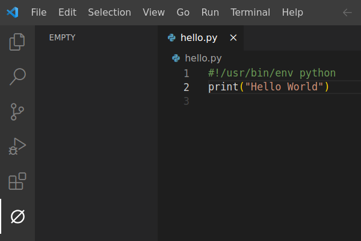

# An empty sidebar for Visual Studio Code

A button in your activity bar emptying your sidebar. Nothing more.

This approach creates free space without ruining your layout.
An empty sidebar enhances your focus and, thereby, your productivity.

## Settings and Commands

None. This extension is just an empty sidebar without any further functionality.

## Contributing

I am always lookings for new ideas and feedback.
Before you open a pull request, please create an issue about your thoughts first.

## Release Notes

See [CHANGELOG.md](CHANGELOG.md)
